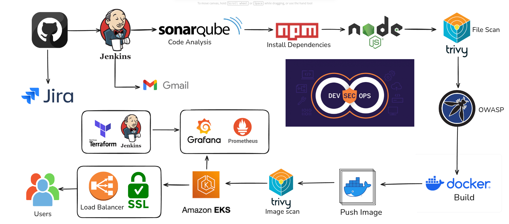

# 🚀 Full DevSecOps CI/CD Pipeline — Jenkins | SonarQube | OWASP | Trivy | Docker | Kubernetes | AWS EKS | Prometheus | Grafana

This project demonstrates a fully automated DevSecOps CI/CD pipeline that performs code quality checks, vulnerability scanning, Docker image creation, Kubernetes deployment on AWS EKS, and continuous monitoring using Prometheus & Grafana. The application deployed through this pipeline is a Hotstar Replica UI.

---

## 🧭 Architecture Workflow Diagram

The following diagram represents the complete DevSecOps architecture implemented in this project:

<p align="center">
  
</p>

---

## 📌 Architecture Flow
```
GitHub → Jenkins → SonarQube → OWASP FS Scan → Trivy FS Scan → Docker Build & Push → Trivy Image Scan → Kubernetes Deployment → AWS EKS → AWS Load Balancer → Prometheus + Grafana → Final Application
```

---

## 🧰 Tools & Technologies Used

| Category | Tools |
|---------|-------|
| Version Control | Git & GitHub |
| CI/CD | Jenkins |
| Code Quality | SonarQube |
| Security | OWASP Scan, Trivy FS Scan, Trivy Image Scan |
| Containerization | Docker & Docker Hub |
| Infrastructure | Kubernetes, Amazon EKS, Terraform |
| Monitoring | Prometheus, Grafana, Blackbox Exporter |
| Notifications | Gmail (Pipeline Email Notification) |

---

## 🔥 Key Features

- Secure end-to-end CI/CD pipeline using DevSecOps practices
- Automated SonarQube code quality gate validation
- OWASP and Trivy filesystem scanning before image build
- Docker image pushed to Docker Hub with tagging and versioning
- Trivy image scanner prevents vulnerable images from deploying
- Kubernetes deployment via `kubectl apply` to AWS EKS
- Load-balanced HTTPS access using AWS Load Balancer
- Real-time external endpoint monitoring (Blackbox Exporter)
- Grafana dashboards for performance visualization and alerting
- CI/CD email notification with scan logs and deployment summary

---

## 🧩 Pipeline Stages

1. Developer pushes code to GitHub  
2. Jenkins triggers the CI/CD pipeline  
3. SonarQube analyzes code and enforces Quality Gate  
4. OWASP + Trivy filesystem scanning  
5. Docker image build and push to Docker Hub  
6. Trivy image vulnerability scan  
7. Kubernetes manifests applied to AWS EKS  
8. Application exposed through AWS Load Balancer  
9. Prometheus & Grafana continuously monitor performance and uptime  

---

## 🏗 Project Folder Structure

```
.
├── assets/
│   └── workflow-diagram.png
├── k8s-manifests/
│   ├── deployment.yaml
│   ├── service.yaml
│   └── ingress.yaml (optional)
├── Jenkinsfile
├── Dockerfile
├── sonar-project.properties
└── src/
```

---

## ▶ Run Locally (Optional)

```bash
git clone <repository-url>
cd <project-folder>
npm install
npm start
```

---

## 📦 Build and Push Docker Image (Optional)

```bash
docker build -t <dockerhub-username>/<image-name>:v1 .
docker push <dockerhub-username>/<image-name>:v1
```

---

## ☸ Deploy to Kubernetes Manually (Optional)

```bash
kubectl apply -f k8s-manifests/
kubectl get pods -o wide
kubectl get svc
```

---

## 📡 Monitoring URLs

| Component | URL |
|----------|-----|
| Prometheus | http://<monitoring-ip>:9090 |
| Grafana | http://<monitoring-ip>:3000 |
| Blackbox Exporter | http://<monitoring-ip>:9115 |

---

## 🌟 Final Output

A production-ready Hotstar-style web application running inside AWS EKS, deployed automatically through CI/CD, scanned for vulnerabilities via DevSecOps, and continuously monitored with Prometheus and Grafana.

---

## 🤝 Contributing

Contributions are welcome. Please open an issue to propose improvements.

---

## 📬 Contact

- LinkedIn: https://www.linkedin.com/in/devanadhan-c-k/
- Email: devanadhan.16102005@gmail.com

---

## ⭐ Support

If you found this repository helpful, consider giving it a **star ⭐**. It motivates the creation of more DevOps open-source projects.
